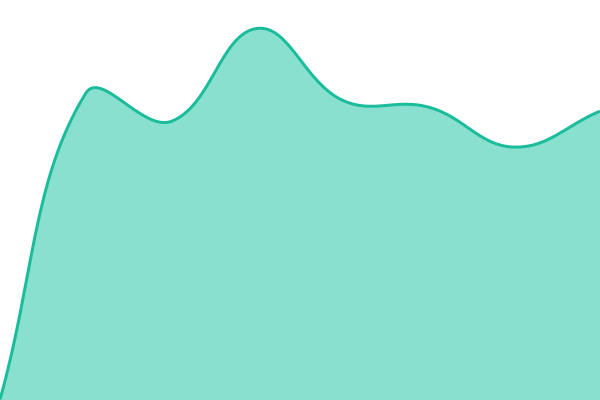
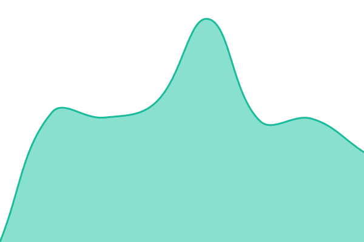

# [📈 Live Status](https://status.kaisaba.net): <!--live status--> **🟩 All systems operational**

This repository contains the open-source uptime monitor and status page for [かい鯖グループ公式](https://kaisaba.net), powered by [Upptime](https://github.com/upptime/upptime).

With [Upptime](https://upptime.js.org), you can get your own unlimited and free uptime monitor and status page, powered entirely by a GitHub repository. We use [Issues](https://github.com/kaisaba-group/status/issues) as incident reports, [Actions](https://github.com/kaisaba-group/status/actions) as uptime monitors, and [Pages](https://status.kaisaba.net) for the status page.

<!--start: status pages-->
<!-- This summary is generated by Upptime (https://github.com/upptime/upptime) -->
<!-- Do not edit this manually, your changes will be overwritten -->
<!-- prettier-ignore -->
| URL | Status | History | Response Time | Uptime |
| --- | ------ | ------- | ------------- | ------ |
|  [かい鯖グループ 公式サイト](https://kaisaba.net) | 🟩 Up | [かい鯖グループ-公式サイト.yml](https://github.com/kaisaba-group/status/commits/HEAD/history/かい鯖グループ-公式サイト.yml) | 

 613ms
     
 | 

<a href="https://status.kaisaba.net/history/かい鯖グループ-公式サイト">100.00%</a>
    

|  [かい鯖グループ フォーラム](https://forum.kaisaba.net) | 🟩 Up | [かい鯖グループ-フォーラム.yml](https://github.com/kaisaba-group/status/commits/HEAD/history/かい鯖グループ-フォーラム.yml) | 

 736ms
     
 | 

<a href="https://status.kaisaba.net/history/かい鯖グループ-フォーラム">100.00%</a>
    

|  [スク解ウェブ](https://sukukai.com) | 🟩 Up | [スク解ウェブ.yml](https://github.com/kaisaba-group/status/commits/HEAD/history/スク解ウェブ.yml) | 

 609ms
     
 | 

<a href="https://status.kaisaba.net/history/スク解ウェブ">100.00%</a>
    

|  [ベーコンウェブ](https://bac0n.f5.si/) | 🟩 Up | [ベーコンウェブ.yml](https://github.com/kaisaba-group/status/commits/HEAD/history/ベーコンウェブ.yml) | 

 741ms
     
 | 

<a href="https://status.kaisaba.net/history/ベーコンウェブ">100.00%</a>
    

|  [かい鯖グループ　プロキシ](mc.kaisaba.net) | 🟩 Up | [かい鯖グループ-プロキシ.yml](https://github.com/kaisaba-group/status/commits/HEAD/history/かい鯖グループ-プロキシ.yml) | 

 127ms
     
 | 

<a href="https://status.kaisaba.net/history/かい鯖グループ-プロキシ">100.00%</a>
    

<!--end: status pages-->

[**Visit our status website →**](https://status.kaisaba.net)

## 📄 License

- Powered by: [Upptime](https://github.com/upptime/upptime)
- Code: [MIT](./LICENSE) © [Anand Chowdhary](https://anandchowdhary.com)
- Data in the `./history` directory: [Open Database License](https://opendatacommons.org/licenses/odbl/1-0/)
